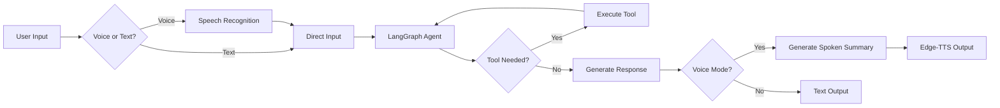

# 🧬 Project Zero: Autonomous AI Agent with Voice & Vision

<p align="center">
  
  
  
  
</p>

**Project Zero** is an autonomous AI engineer capable of writing, executing, debugging, and fixing Python code—all without human intervention. Now featuring **Voice Interface** and **Computer Vision**, it's like having your own Jarvis.

---

## 🚀 Key Capabilities

### 🎤 Voice Interface (NEW!)
- **Speech-to-Text:** Uses Google Speech Recognition for real-time voice input.
- **Text-to-Speech:** Responds naturally using Edge-TTS with Hindi (Hinglish) voice.
- **3-Layer Architecture:**
  1. **Internal Layer** – Agent reasoning (silent, never spoken)
  2. **Spoken Response Layer** – Generates human-friendly Hinglish summary
  3. **TTS Layer** – Only the final response is spoken aloud
- **Feedback Prevention:** Automatically pauses listening while speaking.

### 👁️ Vision Module (NEW!)
- **Webcam Integration:** Captures real-time frames via OpenCV.
- **Gemini 1.5 Flash Analysis:** Sends frames to Google's Gemini for scene understanding.
- **Natural Triggers:** "Kya dikh raha hai?", "What do you see?", "Look at this"
- **Silent Operation:** Uses vision tools without announcing them.

### 🧠 Persistent Memory
- **Long-Term Recall:** SQLite database stores conversation history.
- **Context Awareness:** Remembers scripts, preferences, and errors across sessions.
- **Zero Hallucination:** Checks its memory before answering "Who am I?" or "What did we do yesterday?"

### 🛠️ Self-Healing Code Architecture
- **Recursive Debugging Loop:**
  1. Reads error traceback
  2. Searches web (Tavily API) for solutions
  3. Rewrites the code
  4. Retries execution until success
- **Environment Control:** Can install libraries and manage file system autonomously.

---

## 🏗️ Tech Stack

| Component | Technology |
|-----------|------------|
| **Brain (LLM)** | Llama-3.3-70B via Groq Cloud |
| **Speech LLM** | Llama-3.1-8B Instant (for spoken responses) |
| **Memory** | SQLite + LangGraph Checkpoint |
| **Orchestration** | LangGraph State Machine |
| **Vision** | OpenCV + Gemini 1.5 Flash |
| **Voice (STT)** | Google Speech Recognition |
| **Voice (TTS)** | Edge-TTS (Hindi - MadhurNeural) |
| **Tools** | Tavily Search, subprocess, file I/O |

---

## 📁 Project Structure

```
PROJECT ZERO/
├── main.py          # Entry point & LangGraph agent
├── tools.py         # Tool definitions (search, write, execute, vision)
├── voice.py         # Voice assistant (STT + TTS + 3-layer arch)
├── vision.py        # Webcam capture + Gemini analysis
├── memory.db        # SQLite persistent memory
├── requirements.txt # Dependencies
└── .env             # API keys (GROQ, TAVILY, GOOGLE)
```

---

## ⚡ Quick Start

### 1. Clone the Repository
```bash
git clone https://github.com/umangworkAIML/project-zero-agent.git
cd project-zero-agent
```

### 2. Install Dependencies
```bash
pip install -r requirements.txt
```

> **Note (Windows):** PyAudio may require manual installation:
> ```bash
> pip install pipwin
> pipwin install pyaudio
> ```

### 3. Configure API Keys
Create a `.env` file:
```env
GROQ_API_KEY=your_groq_api_key
TAVILY_API_KEY=your_tavily_api_key
GOOGLE_API_KEY=your_gemini_api_key
```

### 4. Run the Agent

**Text Mode (Default):**
```bash
python main.py
```

**Voice Mode:**
```bash
python main.py --voice
```

---

## 🎯 Usage Examples

| You Say | Agent Does |
|---------|------------|
| "Calculator banao" | Writes and runs a calculator script |
| "Kya dikh raha hai?" | Captures webcam, describes scene in Hinglish |
| "Kal humne kya kiya tha?" | Recalls from memory |
| "Is code ko fix karo" | Debugs, searches web, rewrites, retries |
| "Exit" or "Goodbye" | Shuts down gracefully |

---

## 🔧 Architecture



---

## 🤝 Contributing

Pull requests welcome! For major changes, please open an issue first.

---

## 📜 License

MIT License - Feel free to use, modify, and distribute.

---

<p align="center">
  <b>Built with ❤️ by UMANG</b><br>
  <i>Your personal AI engineer that never sleeps.</i>
</p>